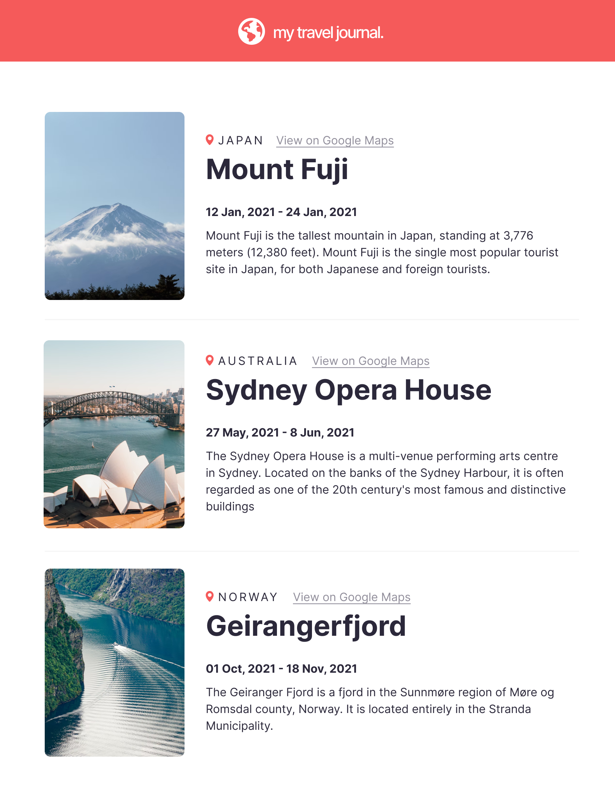

# scrimba-travel-journal
Travel Journal project built with React for Scrimba's Frontend Program.

## Design

## Requirements
- Use Data array from separate .js file
	- This array will include objects with Title, location, GoogleMaps link, start date, end date, description, image URL
- Use Map() and props in React
- Follow design and add personal style/polish